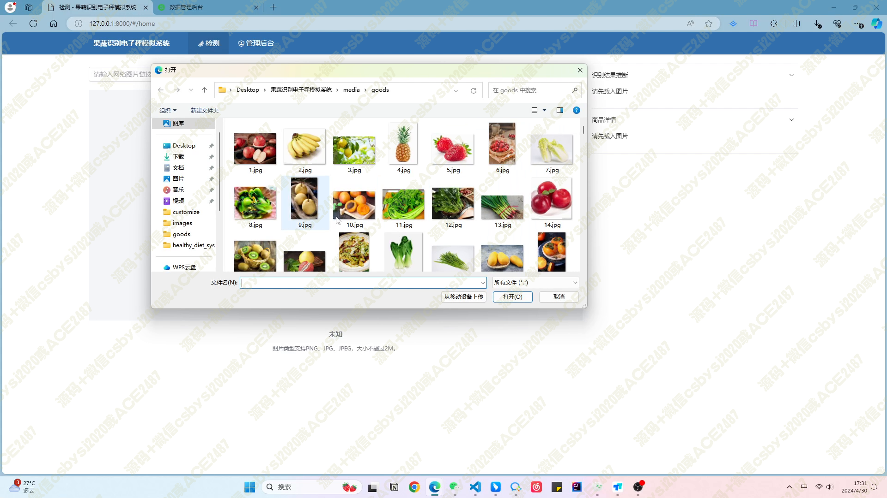
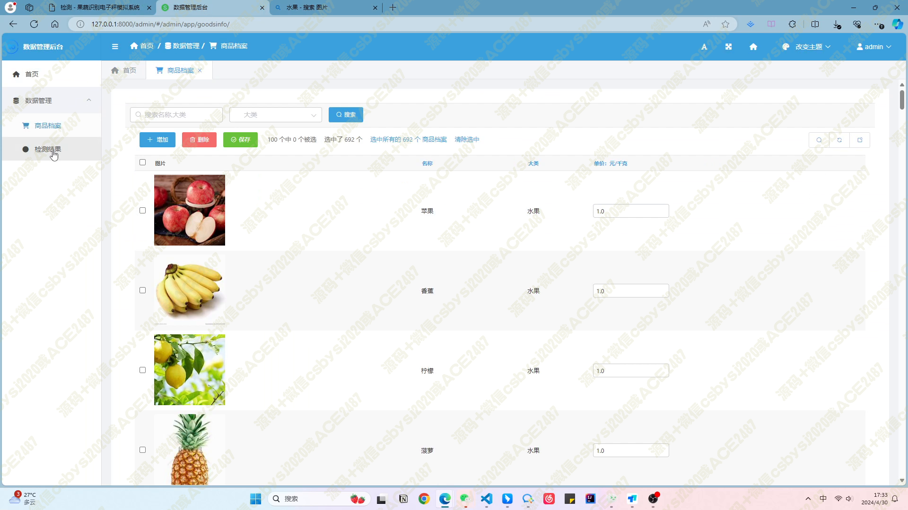
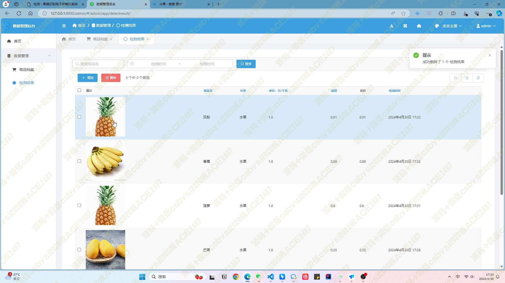
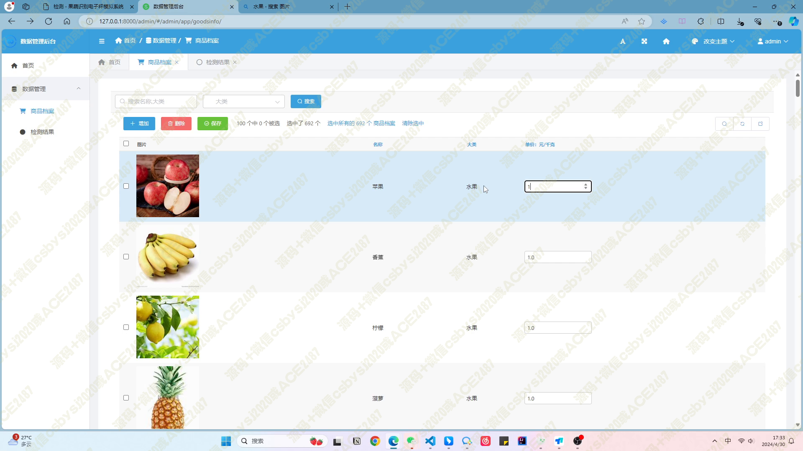
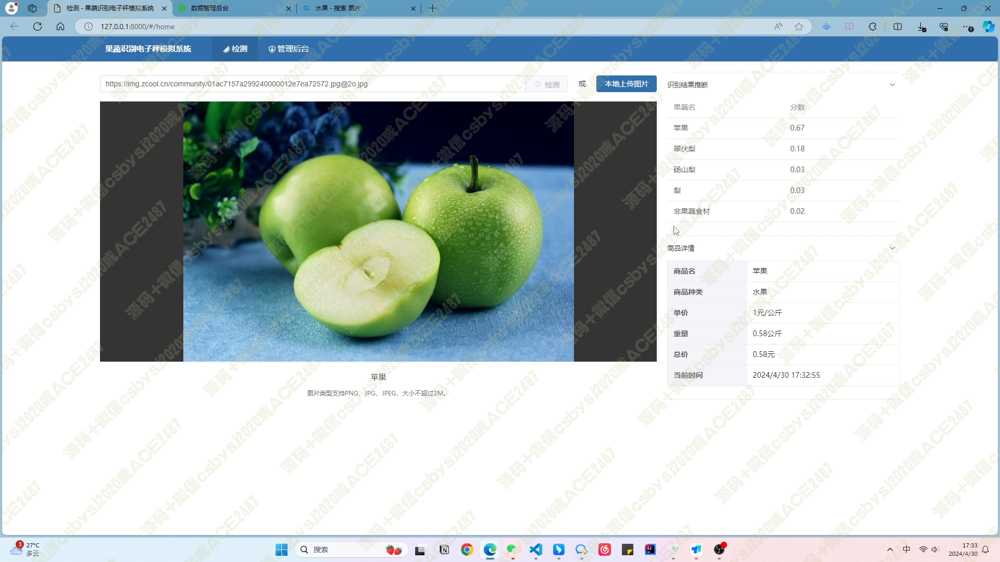
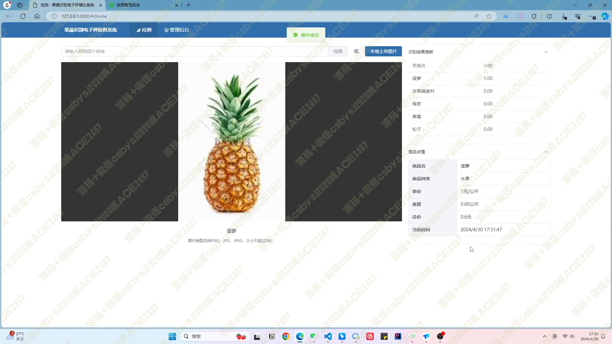
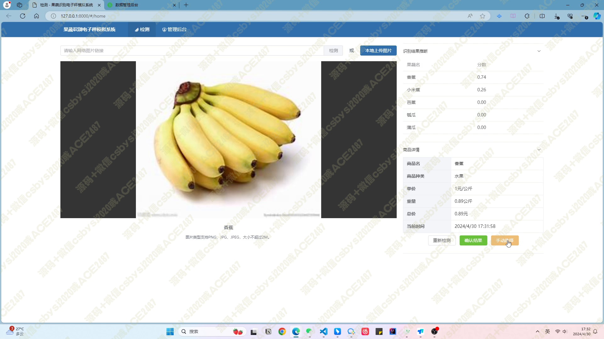
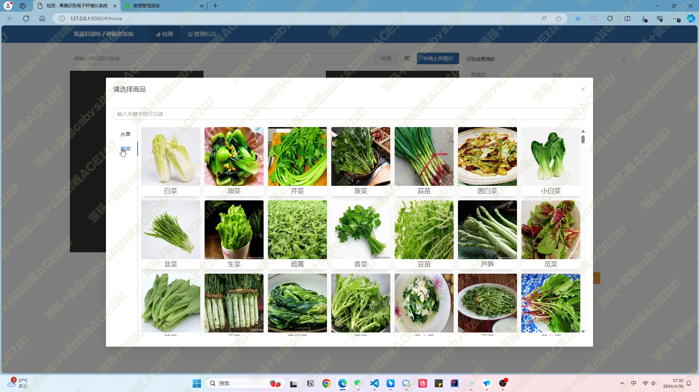

# 043 基于深度学习的果蔬识别电子秤模拟系统-设计展示

> **代码有偿获取 可接受定制 微信联系方式: csbysj2020 或 ACE2487，备注(BS)**

> 

> 

## 项目概述

果蔬识别电子秤模拟系统是一款结合了人工智能和现代 web 技术的创新应用。该系统旨在为零售行业提供一种高效、准确的果蔬识别与计价解决方案。通过整合 Python、Django、Vue、PyTorch、Keras、Element-Plus 和 axios 等先进技术，我们的系统能够实现果蔬的自动识别、价格计算以及数据管理。

## 技术栈

- **Python**: 脚本编写和后端逻辑处理
- **Django**: Web 应用框架，用于构建后端服务
- **Vue**: 前端 JavaScript 框架，用于构建用户界面
- **PyTorch**: 深度学习框架，用于实现果蔬识别模型
- **Keras**: 高级神经网络 API，用于模型训练
- **Element-Plus**: Vue.js 的桌面端组件库，用于前端 UI 组件
- **axios**: 基于 Promise 的 HTTP 客户端，用于前后端通信

## 系统功能

### 后台配置

- **果蔬信息管理**: 系统后台允许管理员配置各种蔬菜水果的封面图、类别和单价（元/千克），确保信息的准确性和实时更新。

### 图片识别与计价

- **智能识别**: 用户上传果蔬图片后，系统利用深度学习模型进行识别，并给出五种可能的果蔬及其置信度。
- **自动计价**: 系统默认选择置信度最高的果蔬，根据后台配置的单价和用户输入的重量自动计算总价。

### 数据记录

- **识别记录**: 后台记录了每次识别的结果，包括识别的果蔬、重量、总价和识别时间，方便进行数据分析和追溯。

## 项目亮点

- **高度智能化**: 利用深度学习技术实现果蔬的精准识别。
- **用户友好**: 基于 Vue 和 Element-Plus 的前端设计，提供流畅的用户体验。
- **易于管理**: 后台管理系统简单易用，便于商家进行日常操作。

## 视频

> **点击查看 \>\>\> [https://www.bilibili.com/video/BV17gpueqEbm/](https://www.bilibili.com/video/BV17gpueqEbm/)**

## 截图

